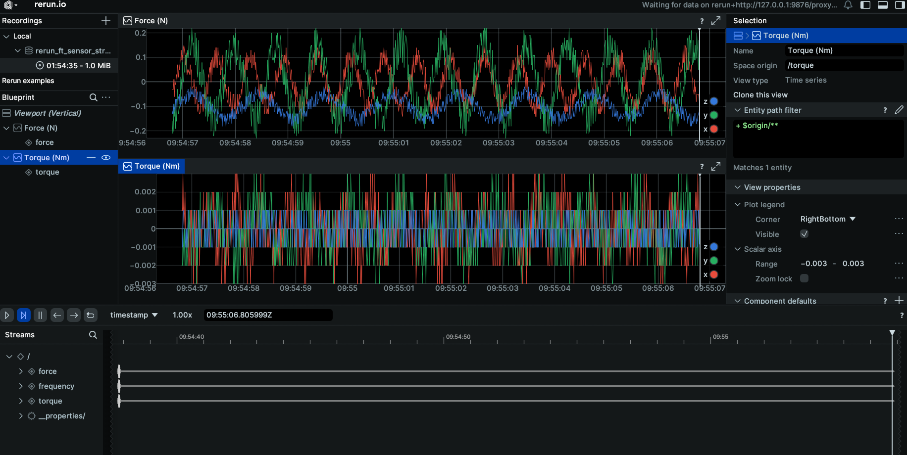

# FT Sensor Data Visualization with Rerun

A project for visualizing Force-Torque (FT) sensor data using the Rerun visualization framework.



## Overview

This project provides multiple ways to visualize FT sensor data:
- Real-time streaming simulation
- CSV data visualization
- Web-based visualization interface

## Prerequisites

- Python with `uv` package manager (pip install uv)
- Rerun visualization framework

## Usage

### Real-time FT Sensor Simulation

Stream simulated FT sensor data and visualize it in real-time with web interface:

```bash
uv run simulate_ft_stream.py | uv run ft_sensor_stream.py --serve-web
```

### CSV Data Visualization

Visualize FT sensor data from CSV files with web interface:

```bash
uv run ft_sensor_csv.py --serve-web
```

### Web Server

Start the web visualization server:

```bash
uv run serve-web.py
```

### Rerun Viewer

Launch the standalone Rerun viewer with web interface:

```bash
rerun --serve-web
```

## Commands Explained

- `simulate_ft_stream.py` - Generates simulated FT sensor data stream
- `ft_sensor_stream.py` - Processes and visualizes streaming FT data
- `ft_sensor_csv.py` - Loads and visualizes FT data from CSV files
- `serve-web.py` - Web server for visualization interface
- `--serve-web` flag - Enables web-based visualization interface (useful for working on remote workstation)

## File Structure

```
rerun-test/
├── README.md
├── docs/
│   └── ft-data.png
├── simulate_ft_stream.py
├── ft_sensor_stream.py
├── ft_sensor_csv.py
└── serve-web.py
```
